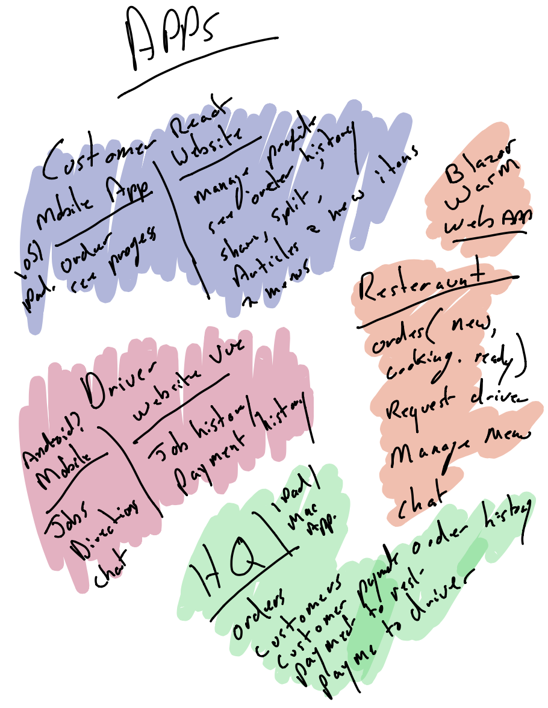
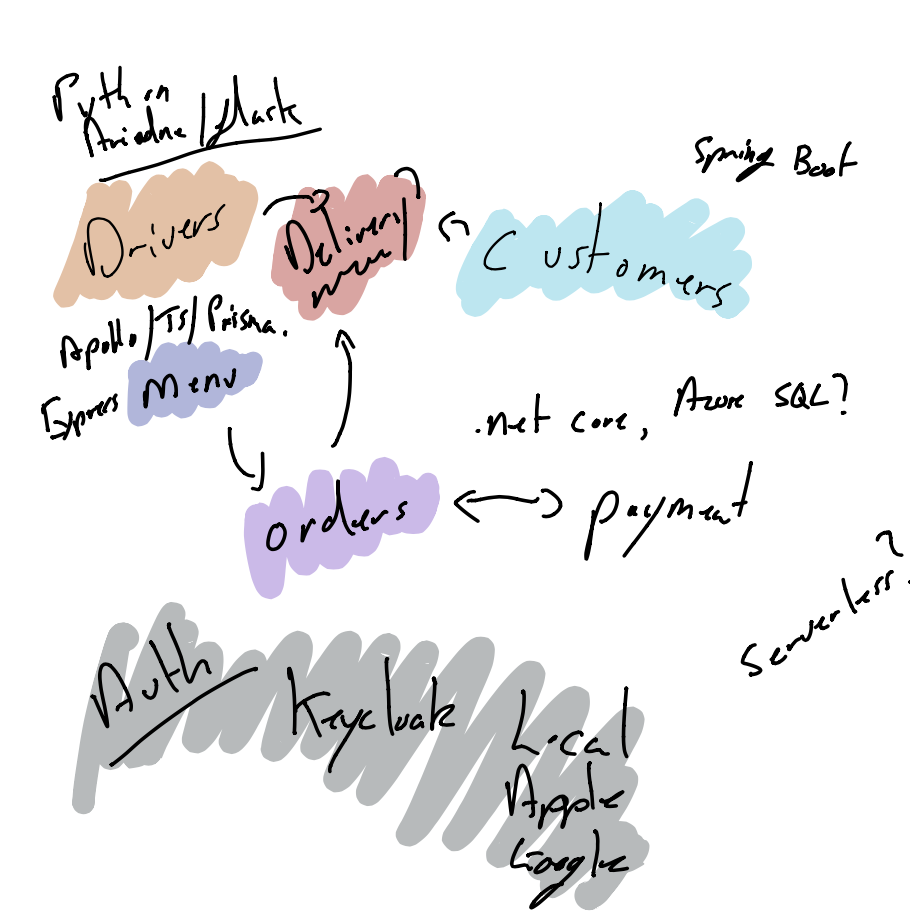
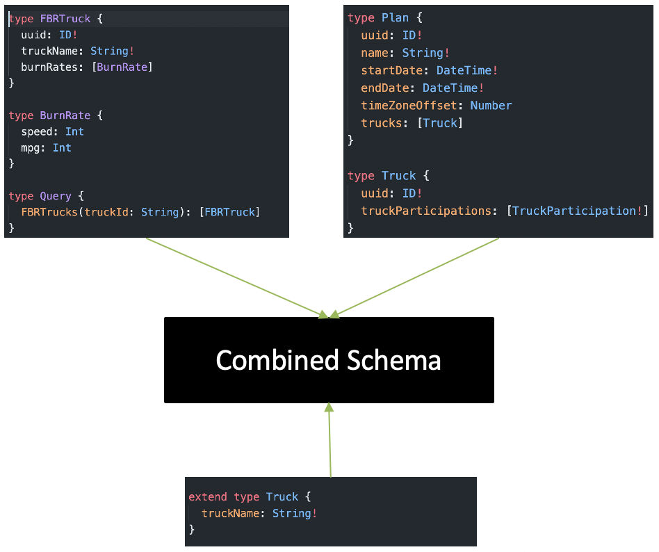
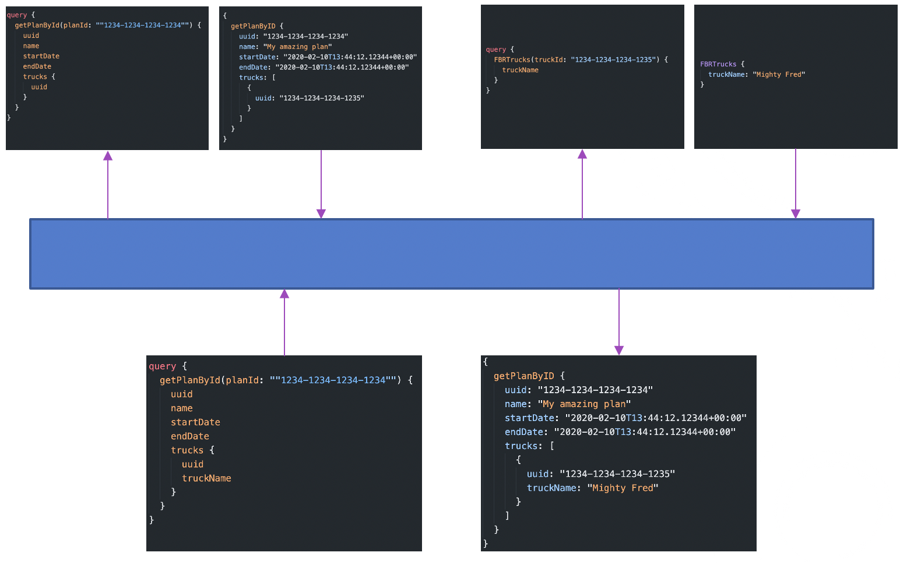

The purpose of this document is to give a high level overview of the technical architecture used to build and host the "We Do Takeaway" (WDT) service.

## Service description
We Do Takeaway is a FOSS platform that can allow restaurants to offer online ordering to their customers and manage and track the fulfillment and delivery of their food.

## Considerations
The purpose of WDT is not only to build a piece of software that may be genuinely useful but also is a a learning exercise in building a GraphQL and Kubernetes based service as well as experimenting with development tools and planning processes. The service elements will form the basis of blog articles and tutorials. This aim fuels the what may appear at first glance of a dumb decision to build the platform with such a wide variety of frameworks. By mixing and matching these frameworks it will allow tools such as .NET Core, Java, Javascript and Go to be compared. 

## Technical Requirements
The WDT service allows users to access it using a variety of clients and technologies. The user should be free to use whatever method they wish that is most convenient to them, be it an iPhone, browser, android device or whatever. In some situations bandwidth may be plenty via desktops with broadband, but in others it will be severely limited via patchy 3G wireless access using small screen mobile devices.

When choosing server tools to use the following must be taken into account:
  * Documentation
  * Reliability
  * Scalability (ease and economy)
  * Testing tools
  * Ease of maintenance
  * Vendor backing (Can 1 person leaving the project break it?)
  * Code quality

The service must be able to scale economically from very small workloads of one or 2 users all the way up to a shared service with 1000's of simultaneous API requests. The service must be something that an individual business itself could deploy, with some help, or form the service layer of a company offering it to multiple restaurants. It may also be used by franchises.

Deployment of server elements must be possible with a single machine and docker-compose but also be fully supported in a Kubernetes cluster, either privately built of via a PAAS such as AWS or Azure.

## Approach

### Servers
The service architectures takes the approach of creating a collection of GraphQL API servers, each one responsible for a defined domain, these include:
  * Customer
  * Menu
  * Order
  * Payment
  * Restaurant
  * Delivery person
  * Delivery tracking
  * Service owner
  * Authentication

Domains are related to each other. One example is the case of an order, there are attributes that are unique to the order itself but it also relates to other information including the customer, restaurant, menu items, delivery details.

#### GraphQL schema stitching

An API Gateway layer combines the multiple GraphQL back-ends into a single API, stitching the different parts of data together. This means that when a query is sent to get the order details including the customer etc it fetches some information from the order server and uses properties in that to go and fetch the customer data from the customer server. All this is transparent to the client.

An alternative to this stitching approach is Federation, though at this time not all GraphQL servers support it and stitching can still provide the functionality required.

### Clients
Eventually a wide range of clients will be required. Within the initial phase of the projects the following will be focussed on:

* Browser based menu browsing and ordering (React JS)
* Browser based management of orders (Blazor WASM)
* Delivery driver app (Android)
* Central admin (HQ) tool (iOS/Mac OS)

Over time new clients will be developed including:

* Menu browsing and ordering via iPhone/iPad and Android
* Delivery driver app on iOS
* Apple watch and Apple TV support
* Combined Mac/iOS support for Apple silicon
* Restaurant mobile management app for iPhone/iPad

The server based API should make it possible for any new client to be developed as long as it has support for GraphQL. When building the server API's they must contain any business logic so that new clients do not need to repeat code, though this may become interesting when a piece of logic spans multiple domains and the API Gateway may need to encompass that, acting as a service layer instead of simple dividing tasks.
