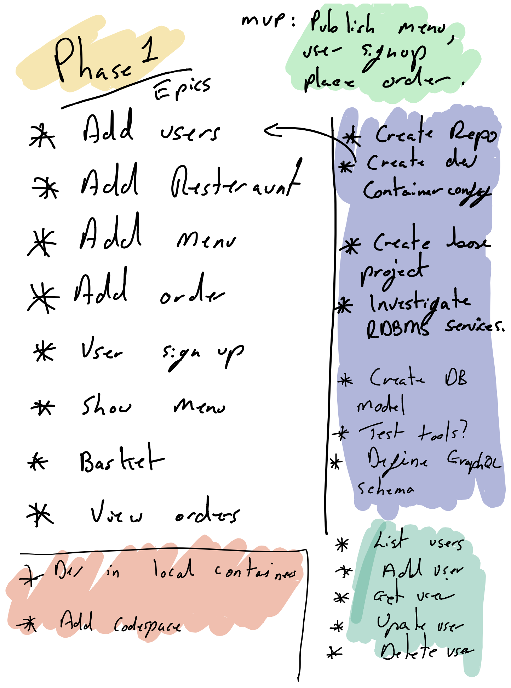

The project is to be built with an iterative approach. The idea is to create something that provides the simplest piece of functionality that can be tested and shown and tried out with a user. Obviously it's not possible to have an initial version that does everything from customer sign up to food delivered but the initial phase Should at least try to provide something.

During the initial sketches of what the service would do the deliverables for phase 1 were sketched out below:

Even this though is really too big and not MVP. So instead a road-map is now being sketched out. The original idea for phase 1 will be re-worked into a goal to reach at some point and then smaller phases and deliverables extracted from that and those will form the steps that will be taken to build the service.

Ideally all these ideas should be tested at every stage with real users, anyone know one?

## Vision for phase 1

The ultimate goal for the project is big a complicated but the focus initially needs to delivery something that delivers the simplest end to end experience.

>*As a customer of "We Do Takeaway" I can view a list of items in a menu, pick the things I want and place the order. The restaurant can see the order and once they are ready can update the status of the order and allocate the delivery to a driver. The driver can see the order number and customer address and then once they have delivered the items can mark the order as delivered.*

The road-map is currently being planned in the [Trello road-map board](https://trello.com/b/6d0JT4DX).

As well as the user perspective a number of technical objectives need to be met also.

>*The platform must provide authentication that forces the customer to login. The different elements of the platform will use JWT to pass authentication related data around. The phase 1 app will include servers written in Ariadne, Spring Boot, .NET Core and clients written in React, Blazor, Android and iOS. Deployment will use Kubernetes and Helm Charts deployed to MicroK8s*

